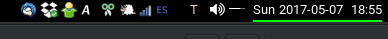
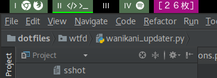
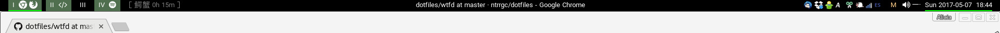

wtfd: A bar feeder
==================

This is my [lemonbar](https://github.com/LemonBoy/bar) feeder, intended to be used with [bspwm](https://github.com/baskerville/bspwm). It's the small program that is piped to lemonbar and generates all the data that is shown.

It listens for changes in the desktop environment, such as windows opened or closed, changes in the focused window title and the system volume and updates accordingly.

It has also a [Wanikani](https://www.wanikani.com/) widget to remember me to do my kanji reviews.

Some highlights of this bar feeder:

 * Very few cases of process spawning.
 * Intended for use with dual monitors.
 * No polling. Except for the Wanikani widget, since they have no push API. Every other thing is only checked in response to events:
    * [xtitle](https://github.com/baskerville/xtitle) is used to track the focused window title.
    * `bspc subscribe` is used to track changes in windows opened, closed or focused.
        * `bspc wm --dump-state` is called after every change to get the current desktop tree (used to render the virtual desktop widgets). This is the only case in `wtfd` where subprocess are created after initialization.
    * [pulse-volume-monitor](https://github.com/ntrrgc/pulse-volume-monitor) is used for the volume widget.
    * System time is scheduled to be checked only after the exact time needed for the current minute to end passes.
 * Written in Python 3, using Tornado instead of Bash.
 * No threads.

Note: wtfd is not intended to be reusable so it has no configuration, just code, everything here; it's something I made just for my own use. That said, if you find some parts useful or inspiring, copy and change as much as you want.

## License

Copyright (c) 2017 Alicia Boya García

MIT License

Permission is hereby granted, free of charge, to any person obtaining a copy
of this software and associated documentation files (the "Software"), to deal
in the Software without restriction, including without limitation the rights
to use, copy, modify, merge, publish, distribute, sublicense, and/or sell
copies of the Software, and to permit persons to whom the Software is
furnished to do so, subject to the following conditions:

The above copyright notice and this permission notice shall be included in all
copies or substantial portions of the Software.

THE SOFTWARE IS PROVIDED "AS IS", WITHOUT WARRANTY OF ANY KIND, EXPRESS OR
IMPLIED, INCLUDING BUT NOT LIMITED TO THE WARRANTIES OF MERCHANTABILITY,
FITNESS FOR A PARTICULAR PURPOSE AND NONINFRINGEMENT. IN NO EVENT SHALL THE
AUTHORS OR COPYRIGHT HOLDERS BE LIABLE FOR ANY CLAIM, DAMAGES OR OTHER
LIABILITY, WHETHER IN AN ACTION OF CONTRACT, TORT OR OTHERWISE, ARISING FROM,
OUT OF OR IN CONNECTION WITH THE SOFTWARE OR THE USE OR OTHER DEALINGS IN THE
SOFTWARE.